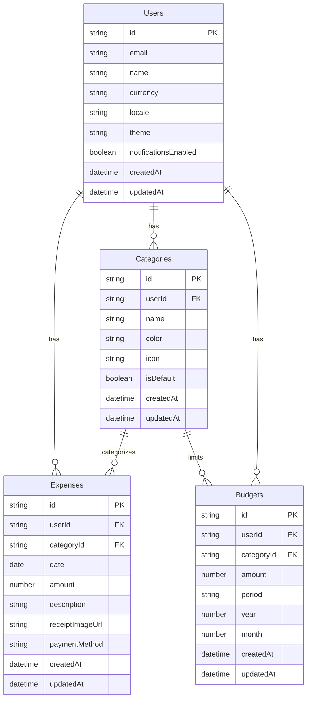

# 支出管理アプリケーション 仕様書

## 1. 概要

個人または家計の支出を記録・管理し、予算管理や支出分析を行うためのアプリケーション。

---

## 2. 主要機能

### 2.1 支出記録機能
- **支出の登録**: 日付、金額、カテゴリ、メモを入力して支出を記録
- **支出の編集**: 既存の支出データを修正
- **支出の削除**: 不要な支出データを削除
- **レシート画像の添付**: 支出の証拠としてレシート画像を保存（オプション）

### 2.2 カテゴリ管理機能
- **カテゴリの作成**: 食費、交通費、娯楽費など、支出カテゴリを自由に作成
- **カテゴリの編集**: カテゴリ名や色の変更
- **カテゴリの削除**: 不要なカテゴリの削除
- **デフォルトカテゴリ**: 初期設定で基本的なカテゴリを提供

### 2.3 予算管理機能
- **月次予算の設定**: カテゴリごとまたは全体の月次予算を設定
- **予算進捗の表示**: 現在の支出額と予算の比較を視覚的に表示
- **予算超過アラート**: 予算を超えた場合に通知

### 2.4 レポート・分析機能
- **期間別集計**: 日次、週次、月次、年次での支出集計
- **カテゴリ別集計**: カテゴリごとの支出割合を円グラフで表示
- **支出トレンド**: 時系列での支出推移を折れ線グラフで表示
- **比較分析**: 前月比、前年同月比などの比較

### 2.5 検索・フィルタ機能
- **期間指定検索**: 特定期間の支出を抽出
- **カテゴリフィルタ**: 特定カテゴリの支出のみ表示
- **金額範囲検索**: 指定金額範囲の支出を検索
- **キーワード検索**: メモ欄からキーワードで検索

### 2.6 データエクスポート機能
- **CSV出力**: 支出データをCSV形式でエクスポート
- **PDF出力**: レポートをPDF形式で出力（オプション）

### 2.7 ユーザー設定機能
- **通貨設定**: 使用する通貨の選択
- **表示設定**: テーマ（ライト/ダーク）、言語設定
- **通知設定**: 予算アラートのON/OFF

---

## 3. データ構造

### 3.1 支出データ (Expenses)

```typescript
interface Expense {
  id: string;                    // 一意のID（UUID）
  userId: string;                // ユーザーID（マルチユーザー対応の場合）
  date: Date;                    // 支出日
  amount: number;                // 金額
  categoryId: string;            // カテゴリID
  description: string;           // メモ・説明
  receiptImageUrl?: string;      // レシート画像URL（オプション）
  paymentMethod?: string;        // 支払い方法（現金、クレジットカード等）
  createdAt: Date;               // 作成日時
  updatedAt: Date;               // 更新日時
}
```

### 3.2 カテゴリデータ (Categories)

```typescript
interface Category {
  id: string;                    // 一意のID（UUID）
  userId: string;                // ユーザーID
  name: string;                  // カテゴリ名
  color: string;                 // 表示色（HEX形式）
  icon?: string;                 // アイコン名またはURL
  isDefault: boolean;            // デフォルトカテゴリかどうか
  createdAt: Date;               // 作成日時
  updatedAt: Date;               // 更新日時
}
```

### 3.3 予算データ (Budgets)

```typescript
interface Budget {
  id: string;                    // 一意のID（UUID）
  userId: string;                // ユーザーID
  categoryId?: string;           // カテゴリID（nullの場合は全体予算）
  amount: number;                // 予算額
  period: 'monthly' | 'yearly';  // 予算期間
  year: number;                  // 対象年
  month?: number;                // 対象月（月次予算の場合）
  createdAt: Date;               // 作成日時
  updatedAt: Date;               // 更新日時
}
```

### 3.4 ユーザーデータ (Users)

```typescript
interface User {
  id: string;                    // 一意のID（UUID）
  email: string;                 // メールアドレス
  name: string;                  // ユーザー名
  currency: string;              // 使用通貨（ISO 4217コード: JPY, USD等）
  locale: string;                // ロケール（ja-JP, en-US等）
  theme: 'light' | 'dark';       // テーマ設定
  notificationsEnabled: boolean; // 通知設定
  createdAt: Date;               // 作成日時
  updatedAt: Date;               // 更新日時
}
```

---

## 4. データベース設計

### 4.1 テーブル関係図



### 4.2 インデックス設計

**Expenses テーブル**
- `idx_expenses_user_date`: (userId, date) - 期間別検索の高速化
- `idx_expenses_category`: (categoryId) - カテゴリ別集計の高速化
- `idx_expenses_user_category_date`: (userId, categoryId, date) - 複合検索の高速化

**Categories テーブル**
- `idx_categories_user`: (userId) - ユーザー別カテゴリ取得の高速化

**Budgets テーブル**
- `idx_budgets_user_period`: (userId, year, month) - 期間別予算取得の高速化

---

## 5. API設計（RESTful API）

### 5.1 支出関連API

| メソッド | エンドポイント | 説明 |
|---------|--------------|------|
| GET | `/api/expenses` | 支出一覧取得（クエリパラメータでフィルタ可） |
| GET | `/api/expenses/:id` | 特定の支出詳細取得 |
| POST | `/api/expenses` | 新規支出登録 |
| PUT | `/api/expenses/:id` | 支出更新 |
| DELETE | `/api/expenses/:id` | 支出削除 |

### 5.2 カテゴリ関連API

| メソッド | エンドポイント | 説明 |
|---------|--------------|------|
| GET | `/api/categories` | カテゴリ一覧取得 |
| GET | `/api/categories/:id` | 特定のカテゴリ詳細取得 |
| POST | `/api/categories` | 新規カテゴリ作成 |
| PUT | `/api/categories/:id` | カテゴリ更新 |
| DELETE | `/api/categories/:id` | カテゴリ削除 |

### 5.3 予算関連API

| メソッド | エンドポイント | 説明 |
|---------|--------------|------|
| GET | `/api/budgets` | 予算一覧取得 |
| GET | `/api/budgets/:id` | 特定の予算詳細取得 |
| POST | `/api/budgets` | 新規予算設定 |
| PUT | `/api/budgets/:id` | 予算更新 |
| DELETE | `/api/budgets/:id` | 予算削除 |

### 5.4 レポート関連API

| メソッド | エンドポイント | 説明 |
|---------|--------------|------|
| GET | `/api/reports/summary` | 期間別集計データ取得 |
| GET | `/api/reports/category` | カテゴリ別集計データ取得 |
| GET | `/api/reports/trend` | 支出トレンドデータ取得 |
| GET | `/api/reports/export` | データエクスポート（CSV） |

---

## 6. 画面構成

### 6.1 主要画面

1. **ダッシュボード**
   - 今月の支出総額
   - 予算進捗状況
   - カテゴリ別支出円グラフ
   - 最近の支出一覧

2. **支出一覧画面**
   - 支出リスト（日付降順）
   - フィルタ・検索機能
   - 新規登録ボタン

3. **支出登録・編集画面**
   - 日付入力
   - 金額入力
   - カテゴリ選択
   - メモ入力
   - レシート画像アップロード

4. **カテゴリ管理画面**
   - カテゴリ一覧
   - カテゴリ追加・編集・削除

5. **予算設定画面**
   - 月次予算設定
   - カテゴリ別予算設定

6. **レポート画面**
   - 期間選択
   - グラフ表示（円グラフ、折れ線グラフ）
   - データテーブル

7. **設定画面**
   - ユーザー情報
   - 通貨・言語設定
   - テーマ設定
   - 通知設定

---

## 7. 技術スタック（推奨）

### 7.1 フロントエンド
- **フレームワーク**: React / Next.js または Vue.js / Nuxt.js
- **状態管理**: Redux / Zustand または Pinia
- **UIライブラリ**: Material-UI / Ant Design / Chakra UI
- **グラフライブラリ**: Chart.js / Recharts / ApexCharts
- **日付処理**: date-fns / Day.js

### 7.2 バックエンド
- **フレームワーク**: Node.js (Express) / Python (FastAPI/Django) / Go (Gin)
- **データベース**: PostgreSQL / MySQL / SQLite
- **認証**: JWT / OAuth 2.0
- **ファイルストレージ**: AWS S3 / Google Cloud Storage（レシート画像用）

### 7.3 モバイルアプリ（オプション）
- **フレームワーク**: React Native / Flutter
- **ローカルDB**: SQLite / Realm

---

## 8. セキュリティ要件

- **認証**: メールアドレス＋パスワード、またはソーシャルログイン
- **認可**: ユーザーは自分のデータのみアクセス可能
- **データ暗号化**: 通信はHTTPS、パスワードはハッシュ化
- **入力検証**: SQLインジェクション、XSS対策
- **レート制限**: API呼び出しの制限

---

## 9. 非機能要件

- **パフォーマンス**: ページ読み込み時間 < 2秒
- **可用性**: 稼働率 99.9%以上
- **スケーラビリティ**: 10万ユーザーまで対応可能
- **バックアップ**: 日次自動バックアップ
- **レスポンシブ対応**: スマートフォン、タブレット、PCに対応

---

## 10. 今後の拡張機能（オプション）

- **定期支出の自動登録**: サブスクリプションなど定期的な支出の自動記録
- **収入管理**: 支出だけでなく収入も管理
- **複数アカウント対応**: 家族や共同アカウントでの支出管理
- **銀行連携**: 銀行口座やクレジットカードと連携して自動取込
- **AI分析**: 支出パターンの分析と節約提案
- **多言語対応**: 英語、中国語など複数言語サポート
- **音声入力**: 音声で支出を記録

---

## 11. 開発フェーズ

### Phase 1: MVP（最小実行可能製品）
- 支出の登録・編集・削除
- カテゴリ管理
- 基本的な一覧表示
- 簡易レポート（月次集計）

### Phase 2: 機能拡張
- 予算管理機能
- 詳細なレポート・グラフ
- 検索・フィルタ機能
- データエクスポート

### Phase 3: 高度な機能
- レシート画像管理
- モバイルアプリ
- 定期支出管理
- 銀行連携（オプション）

---

## 12. まとめ

この仕様書は、基本的な支出管理アプリケーションの要件を網羅しています。開発の規模や目的に応じて、機能を追加・削減してカスタマイズしてください。
