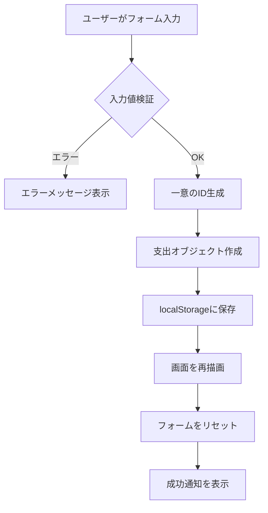
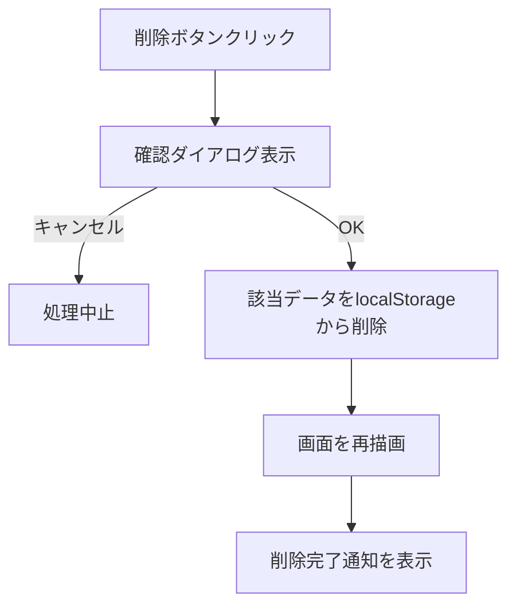

# 支出記録アプリ（Expense Tracker）仕様書

## 📋 概要

### プロジェクト名
**支出管理アプリ開発（AI活用型）**

### 目的
個人の日々の支出を簡単に記録・管理し、カテゴリ別の集計を通じて支出傾向を可視化するWebアプリケーション。ブラウザのlocalStorageを活用することで、サーバー不要で動作する軽量なアプリケーションを実現。

### 主な特徴
- ✅ **シンプルな操作性**: 直感的なUIで誰でも簡単に使用可能
- ✅ **オフライン動作**: インターネット接続不要で利用可能
- ✅ **データ永続化**: ブラウザのlocalStorageにデータを保存
- ✅ **リアルタイム集計**: カテゴリ別の支出を自動集計
- ✅ **レスポンシブデザイン**: PC・スマートフォン両対応

---

## 🖥️ 画面構成

### 全体レイアウト

```
┌─────────────────────────────────────────────────────┐
│                  💰 支出管理アプリ                    │
│                     (ヘッダー)                        │
└─────────────────────────────────────────────────────┘
┌─────────────────────────────────────────────────────┐
│                 📝 支出を記録                         │
│  ┌───────────────────────────────────────────────┐  │
│  │ 日付:     [2026-01-02        ▼]              │  │
│  │ カテゴリ: [選択してください   ▼]              │  │
│  │ 金額:     [                   ] 円            │  │
│  │ メモ:     [                   ]               │  │
│  │                                               │  │
│  │           [ 記録する ]                        │  │
│  └───────────────────────────────────────────────┘  │
└─────────────────────────────────────────────────────┘
┌─────────────────────────────────────────────────────┐
│               📊 カテゴリ別集計                       │
│  ┌──────────┐ ┌──────────┐ ┌──────────┐          │
│  │ 🍽️ 食費  │ │ 🚃 交通費│ │ 🎮 娯楽費│          │
│  │ ¥12,500  │ │  ¥3,200  │ │  ¥5,000  │          │
│  └──────────┘ └──────────┘ └──────────┘          │
│                                                     │
│  ┌─────────────────────────────────────────────┐  │
│  │         合計: ¥45,800                        │  │
│  └─────────────────────────────────────────────┘  │
└─────────────────────────────────────────────────────┘
┌─────────────────────────────────────────────────────┐
│                 📋 支出一覧                          │
│  [ 今月 ] [ すべて ]                                │
│  ┌───────────────────────────────────────────────┐  │
│  │ 2026/01/02  🍽️ 食費      ランチ代            │  │
│  │                            ¥1,200  [削除]    │  │
│  ├───────────────────────────────────────────────┤  │
│  │ 2026/01/01  🚃 交通費    電車代              │  │
│  │                              ¥500  [削除]    │  │
│  └───────────────────────────────────────────────┘  │
└─────────────────────────────────────────────────────┘
```

### 画面詳細

#### 1. ヘッダーセクション
- アプリケーション名とアイコンを表示
- グラデーション背景で視覚的に魅力的なデザイン

#### 2. 支出記録フォーム
- **日付入力**: カレンダーピッカーで日付選択（デフォルト: 今日）
- **カテゴリ選択**: ドロップダウンメニューで7種類から選択
- **金額入力**: 数値のみ入力可能（0以上）
- **メモ入力**: 任意のテキスト入力（例: ランチ代、電車代）
- **記録ボタン**: クリックでデータ保存＆フォームリセット

#### 3. カテゴリ別集計セクション
- カテゴリごとの合計金額をカード形式で表示
- 各カテゴリにアイコンと色を設定
- 最下部に全カテゴリの合計金額を強調表示

#### 4. 支出一覧セクション
- **フィルタボタン**: 「今月」「すべて」で表示切替
- **支出リスト**: 日付降順で表示
  - 日付、カテゴリ、メモ、金額を表示
  - 各項目に削除ボタン
- **スクロール**: 多数の支出がある場合はスクロール可能

---

## 🔄 入出力仕様

### 1. 支出記録機能

#### 入力項目

| 項目名 | 型 | 必須 | 制約 | デフォルト値 | 例 |
|--------|-----|------|------|-------------|-----|
| 日付 | Date | ✅ | - | 今日の日付 | 2026-01-02 |
| カテゴリ | String | ✅ | 7種類から選択 | - | 食費 |
| 金額 | Number | ✅ | 0以上の整数 | - | 1200 |
| メモ | String | ❌ | 最大255文字 | 空文字 | ランチ代 |

#### カテゴリ一覧

| カテゴリ名 | アイコン | 説明 |
|-----------|---------|------|
| 食費 | 🍽️ | 食事、飲料、食材など |
| 交通費 | 🚃 | 電車、バス、タクシーなど |
| 娯楽費 | 🎮 | 映画、ゲーム、趣味など |
| 日用品 | 🛒 | 生活必需品、消耗品など |
| 医療費 | 💊 | 病院、薬、健康関連 |
| 光熱費 | 💡 | 電気、ガス、水道など |
| その他 | 📝 | 上記以外の支出 |

#### 処理フロー



#### 出力（localStorage保存形式）

```json
{
  "id": "1704182400000",
  "date": "2026-01-02",
  "category": "食費",
  "amount": 1200,
  "memo": "ランチ代"
}
```

---

### 2. 支出一覧表示機能

#### 入力
- **フィルタ条件**: `'current'`（今月）または `'all'`（すべて）

#### 処理
1. localStorageから全支出データを取得
2. フィルタ条件に応じてデータを絞り込み
3. 日付降順でソート
4. HTML要素として描画

#### 出力（画面表示）

各支出項目は以下の情報を含む：
- 日付（YYYY/MM/DD形式）
- カテゴリ（アイコン付きバッジ）
- メモ（存在する場合のみ）
- 金額（カンマ区切り、¥マーク付き）
- 削除ボタン

#### 削除機能



---

### 3. カテゴリ別集計機能

#### 入力
- 現在表示中の支出データ（フィルタ適用済み）

#### 処理
1. 支出データをカテゴリごとにグループ化
2. 各カテゴリの金額を合計
3. 全カテゴリの総合計を計算

#### 出力

**カテゴリ別集計オブジェクト**
```javascript
{
  "食費": 12500,
  "交通費": 3200,
  "娯楽費": 5000,
  "日用品": 8900,
  "医療費": 0,
  "光熱費": 15200,
  "その他": 1000
}
```

**総合計**
```javascript
45800  // 全カテゴリの合計
```

#### 画面表示仕様
- 金額が0円のカテゴリも表示
- 金額はカンマ区切りで表示（例: ¥12,500）
- カテゴリは金額降順で並び替え
- 総合計は目立つデザインで強調表示

---

## 💻 使用技術

### フロントエンド

#### HTML5
- **バージョン**: HTML5
- **役割**: アプリケーションの構造定義
- **主要要素**:
  - セマンティックタグ（`<header>`, `<section>`）
  - フォーム要素（`<form>`, `<input>`, `<select>`）
  - 日付入力（`<input type="date">`）
  - 数値入力（`<input type="number">`）

#### CSS3
- **バージョン**: CSS3
- **役割**: スタイリングとレイアウト
- **主要技術**:
  - **Flexbox**: レスポンシブレイアウト
  - **Grid Layout**: カテゴリカードの配置
  - **Gradient**: グラデーション背景
  - **Transition/Animation**: スムーズなアニメーション
  - **Media Queries**: レスポンシブ対応（768px以下でモバイル表示）
  - **Custom Scrollbar**: カスタムスクロールバー

**カラーパレット**
```css
/* プライマリカラー */
--primary-gradient: linear-gradient(135deg, #667eea 0%, #764ba2 100%);

/* カテゴリカラー */
--category-bg: linear-gradient(135deg, #f5f7fa 0%, #c3cfe2 100%);

/* アクセントカラー */
--accent-color: #667eea;
--delete-color: #ff4757;
```

#### JavaScript (ES6+)
- **バージョン**: ECMAScript 2015+
- **役割**: アプリケーションロジックとデータ管理
- **主要機能**:
  - **クラスベース設計**: `ExpenseManager`, `ExpenseUI`
  - **localStorage API**: データ永続化
  - **DOM操作**: 動的なHTML生成
  - **イベントハンドリング**: ユーザー操作の処理
  - **日付処理**: 日付のフォーマットと比較
  - **数値フォーマット**: `toLocaleString()` でカンマ区切り

**主要クラス**

```javascript
// データ管理クラス
class ExpenseManager {
  - loadExpenses()      // localStorageからデータ読み込み
  - saveExpenses()      // localStorageにデータ保存
  - addExpense()        // 新規支出追加
  - deleteExpense()     // 支出削除
  - getAllExpenses()    // 全支出取得
  - getCurrentMonthExpenses()  // 今月の支出取得
  - getCategorySummary()       // カテゴリ別集計
  - getTotalAmount()           // 合計金額計算
}

// UI管理クラス
class ExpenseUI {
  - handleSubmit()           // フォーム送信処理
  - deleteExpense()          // 削除処理
  - render()                 // 画面全体再描画
  - renderExpenseList()      // 支出一覧描画
  - renderCategorySummary()  // カテゴリ別集計描画
  - formatDate()             // 日付フォーマット
  - formatNumber()           // 数値フォーマット
  - showNotification()       // 通知表示
}
```

---

## 💾 データ構造（localStorage利用）

### localStorage キー
```
"expenses"  // 全支出データを格納
```

### データ形式

#### 保存形式（JSON配列）
```json
[
  {
    "id": "1704182400000",
    "date": "2026-01-02",
    "category": "食費",
    "amount": 1200,
    "memo": "ランチ代"
  },
  {
    "id": "1704096000000",
    "date": "2026-01-01",
    "category": "交通費",
    "amount": 500,
    "memo": "電車代"
  },
  {
    "id": "1704009600000",
    "date": "2025-12-31",
    "category": "娯楽費",
    "amount": 3000,
    "memo": "映画鑑賞"
  }
]
```

### データ項目詳細

| フィールド名 | 型 | 必須 | 説明 | 例 |
|-------------|-----|------|------|-----|
| `id` | String | ✅ | 一意識別子（タイムスタンプ） | "1704182400000" |
| `date` | String | ✅ | 支出日（ISO 8601形式） | "2026-01-02" |
| `category` | String | ✅ | カテゴリ名 | "食費" |
| `amount` | Number | ✅ | 金額（整数） | 1200 |
| `memo` | String | ❌ | メモ（空文字可） | "ランチ代" |

### localStorage操作

#### データ保存
```javascript
localStorage.setItem('expenses', JSON.stringify(expensesArray));
```

#### データ読み込み
```javascript
const data = localStorage.getItem('expenses');
const expenses = data ? JSON.parse(data) : [];
```

#### データ削除（特定の支出）
```javascript
expenses = expenses.filter(expense => expense.id !== targetId);
localStorage.setItem('expenses', JSON.stringify(expenses));
```

#### データ全削除
```javascript
localStorage.removeItem('expenses');
// または
localStorage.clear();
```

### データ容量
- **localStorage制限**: 約5MB（ブラウザにより異なる）
- **1支出あたりのサイズ**: 約100-200バイト
- **推定保存可能件数**: 約25,000件以上

---

## 🔒 データ管理とセキュリティ

### データの永続性
- ブラウザを閉じてもデータは保持される
- 同一オリジン（ドメイン）内でのみアクセス可能
- ブラウザのキャッシュクリアでデータが削除される可能性あり

### バックアップ推奨
- 定期的にデータをエクスポート（将来の拡張機能）
- 重要なデータは別途記録を推奨

### プライバシー
- データはユーザーのブラウザ内にのみ保存
- サーバーへの送信なし
- 第三者によるアクセス不可

---

## 📱 レスポンシブ対応

### ブレークポイント
- **デスクトップ**: 769px以上
- **モバイル**: 768px以下

### モバイル最適化
- タッチ操作に適したボタンサイズ
- 縦スクロールに最適化されたレイアウト
- カテゴリカードを1列表示に変更
- フォント・余白の調整

---

## 🚀 今後の拡張可能性

### Phase 2（将来の機能）
- [ ] データエクスポート（CSV/JSON）
- [ ] データインポート機能
- [ ] 月次・年次レポート
- [ ] グラフ表示（Chart.js）
- [ ] 予算設定と進捗管理
- [ ] 定期支出の自動登録
- [ ] 複数通貨対応
- [ ] ダークモード切替

### Phase 3（高度な機能）
- [ ] クラウド同期（Firebase等）
- [ ] 複数デバイス間の同期
- [ ] レシート画像のOCR読み取り
- [ ] AI による支出分析と提案
- [ ] PWA対応（オフラインアプリ化）

---

## 📚 参考資料

### Web API
- [localStorage - MDN Web Docs](https://developer.mozilla.org/ja/docs/Web/API/Window/localStorage)
- [Date - JavaScript | MDN](https://developer.mozilla.org/ja/docs/Web/JavaScript/Reference/Global_Objects/Date)

### デザインリファレンス
- グラデーション: [UI Gradients](https://uigradients.com/)
- アイコン: Unicode Emoji

---

## 📄 ライセンス

このプロジェクトはMITライセンスの下で公開されています。

---

**作成日**: 2026年1月2日  
**バージョン**: 1.0.0  
**作成者**: AI活用型開発チーム
